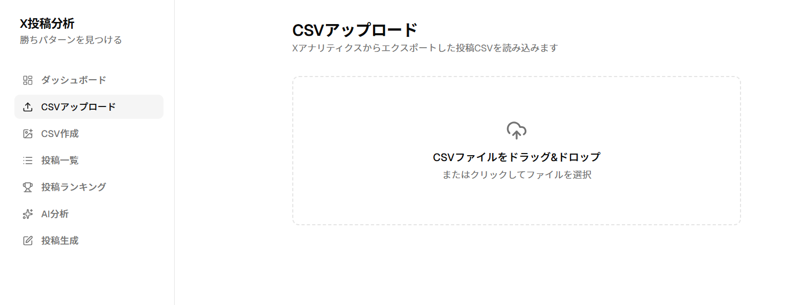
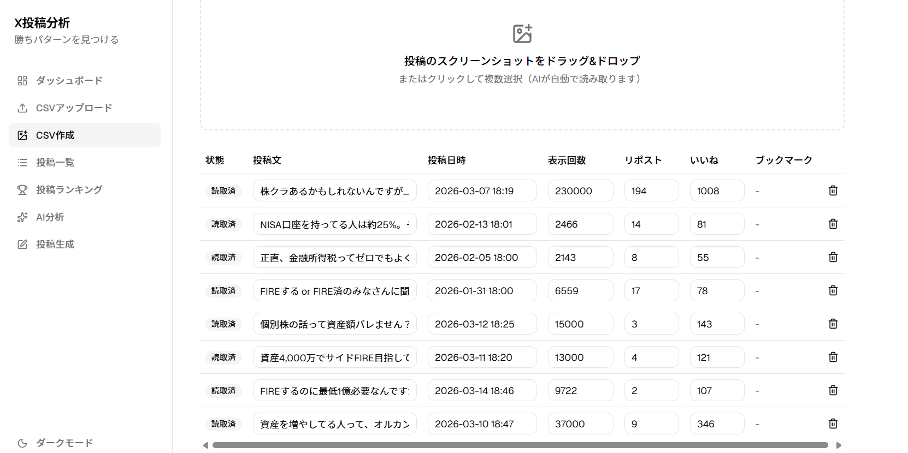
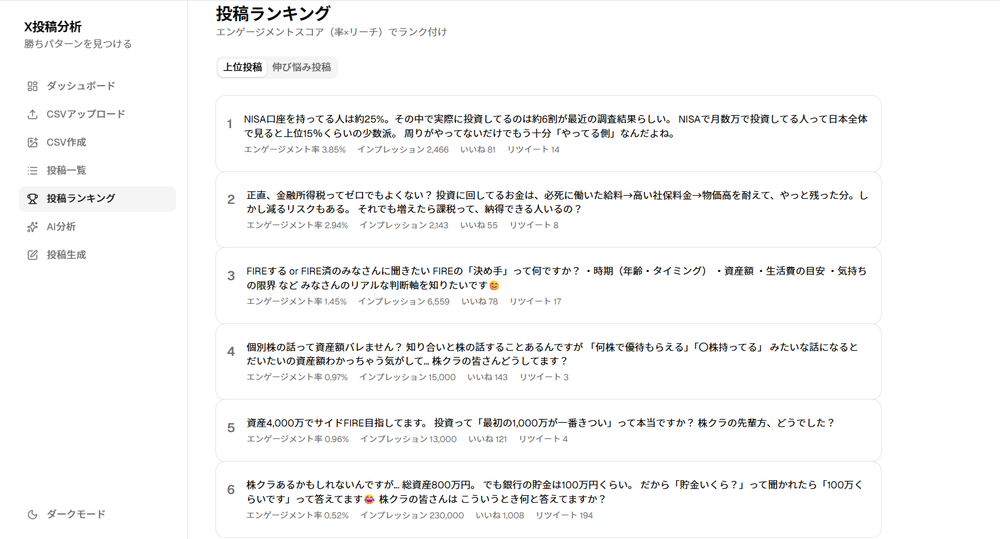
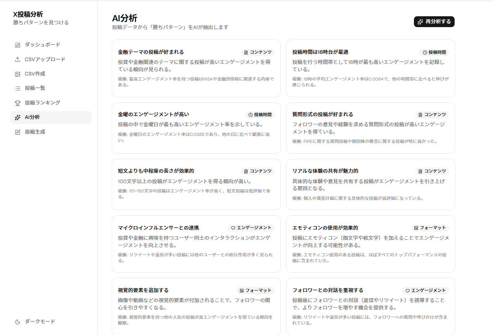
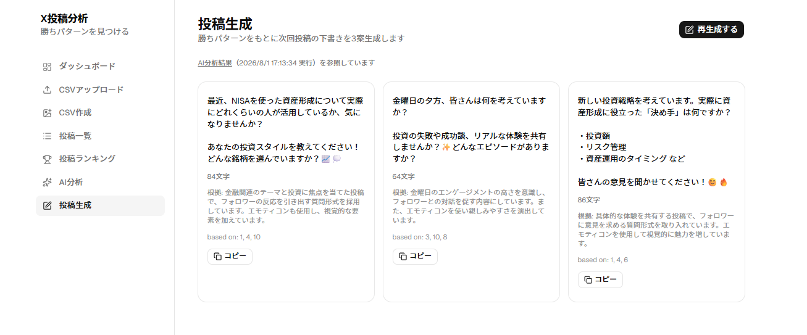

# X投稿分析

X（旧Twitter）の投稿CSVエクスポートをAIが分析し、伸びる投稿の「勝ちパターン」を可視化、
次回投稿案まで生成する個人向けWebアプリ。詳細な要件は [要件定義書.md](./要件定義書.md) を参照。

## スクリーンショット

| CSVアップロード | CSV作成（スクショ取込） |
|---|---|
|  |  |

| 投稿ランキング | AI分析 |
|---|---|
|  |  |

| 投稿生成 |
|---|
|  |

## 技術スタック

- [React](https://react.dev/) 19 + [TypeScript](https://www.typescriptlang.org/) + [Vite](https://vite.dev/)
- [Tailwind CSS](https://tailwindcss.com/) v4 + [shadcn/ui](https://ui.shadcn.com/)（[Base UI](https://base-ui.com/) ベース）
- [Recharts](https://recharts.org/)（グラフ描画）
- [Papa Parse](https://www.papaparse.com/)（CSVパース）
- [React Router](https://reactrouter.com/)（ルーティング）
- [Zod](https://zod.dev/)（スキーマバリデーション）
- [OpenAI API](https://platform.openai.com/docs)（`gpt-4o-mini`）— 勝ちパターン分析・投稿改善提案・
  次回投稿生成・スクリーンショットからの投稿情報読み取り（Vision）
- [Vercel](https://vercel.com/)（ホスティング + Serverless Functions で `/api` を提供）
- LocalStorage（データ永続化、DBなし）

## セットアップ

```bash
npm install
```

AI分析・投稿生成機能を使うには OpenAI APIキーが必要です。`.env.example` を `.env.local` にコピーし、
`OPENAI_API_KEY` を設定してください（未設定でもCSVアップロード・ダッシュボード・投稿一覧・
ランキングは利用できます）。

## 開発

フロントエンドのみ（`/api` は動きません）:

```bash
npm run dev
```

`/api` を含めてフルに動作確認する場合（要 [Vercel CLI](https://vercel.com/docs/cli) ログイン）:

```bash
npx vercel dev
```

## その他コマンド

```bash
npm run build    # 型チェック + 本番ビルド
npm run lint     # oxlint
npm run preview  # ビルド成果物のプレビュー
```

## 動作確認用サンプルCSV

`fixtures/sample-posts.csv`（30件）、`fixtures/sample-posts-1000.csv`（1000件・パフォーマンス確認用）
をCSVアップロード画面から読み込むと、実データなしでも一通りの機能を試せます。

## データの集め方（重要）

X（無料・有料アカウントとも）には「投稿本文つきの投稿別CSV」を直接エクスポートする機能がありません
（アナリティクスホームから取れるのは日別集計のみ）。そのため、このアプリは **Notionのデータベースで
手動収集 → CSVエクスポート → アップロード** という運用を前提にしています。

### Notion側のセットアップ

Notionでデータベースを作り、以下の列名（プロパティ名）で作成してください。列名を変えると
自動マッピングされない場合があるので、`fixtures/notion-template.csv` の見出し行をそのまま使うのが確実です。

| Notionプロパティ名 | 型 | 内容 |
|---|---|---|
| 本文 | タイトル | 投稿のテキスト（必須） |
| 投稿日時 | 日付（時刻あり） | 投稿した日時（必須） |
| 表示回数 | 数値 | 投稿ページで公開されている表示回数（インプレッションの代わり） |
| いいね数 | 数値 | 公開されているいいね数 |
| リポスト数 | 数値 | 公開されているリポスト数 |
| 返信数 | 数値 | 公開されている返信数 |
| URL | URL | 投稿へのリンク（任意） |

「表示回数・いいね数・リポスト数・返信数」はどれもX上で誰でも見られる公開情報なので、
自分の投稿でも気になる他アカウントの投稿でも、1件ずつ見ながら手入力できます
（自動収集・スクレイピングは規約上行いません）。

「engagements（合計エンゲージメント数）」列は無くてOKです。未入力の場合は
いいね数+リポスト数+返信数の合計で自動的に補完されます（`normalizeHeaders.ts` の
`mapRowToPost` を参照）。

### エクスポート手順

1. Notionのデータベース右上の「•••」→「エクスポート」→ 形式を「CSV」にしてエクスポート
2. 書き出されたCSVをこのアプリの「CSVアップロード」画面からアップロード

### スクリーンショットからCSVを作成する

Notionでの手入力の代わりに、アプリ内の「CSV作成」画面から投稿のスクリーンショットをアップロード
すると、AI（OpenAI Vision）が本文・投稿日時・表示回数・リポスト数・いいね数を自動で読み取り、
CSVとしてダウンロードできます（読み取り結果は画面上で修正可能）。「既存のCSVに追加する」から
過去に作成したCSVを読み込み、追加で読み取った投稿を積み足すこともできます。
